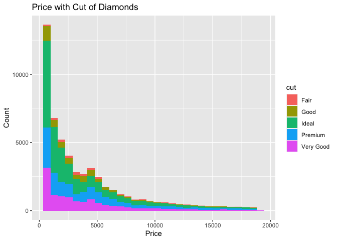
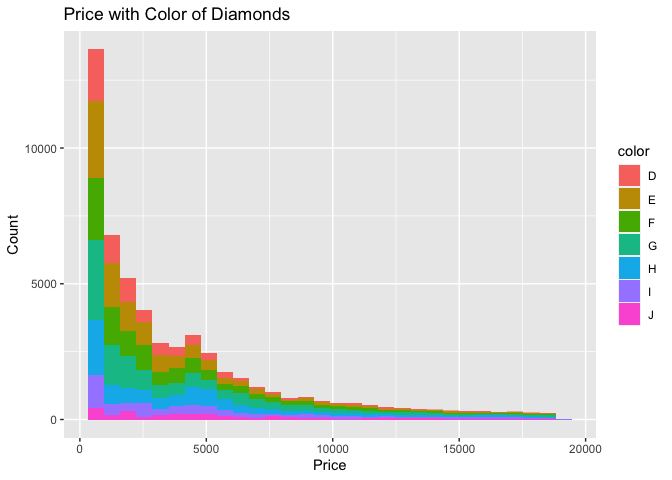
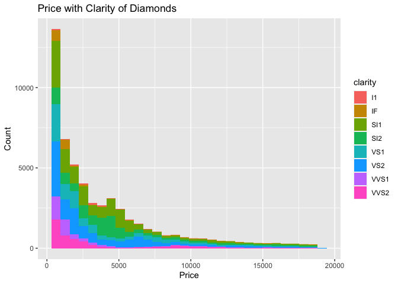
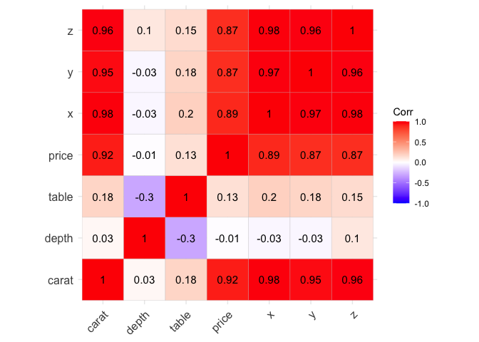

Diamond Data Analysis
================

-   [Libraries & Data](#libraries--data)
-   [Data Cleaning](#data-cleaning)
    -   [Count N/A Values](#count-na-values)
    -   [Remove Wrong Entries](#remove-wrong-entries)
    -   [Plotting Outliers](#plotting-outliers)
-   [Exploratory Data Analysis](#exploratory-data-analysis)
    -   [Summary Stats](#summary-stats)
    -   [Price Plots](#price-plots)
-   [Predict Price](#predict-price)
    -   [Spliting Data](#spliting-data)
    -   [Train Model](#train-model)
    -   [Predict](#predict)
    -   [Results](#results)

## Libraries & Data

``` r
library(tidyverse)
```

    ## ── Attaching packages ─────────────────────────────────────── tidyverse 1.3.2 ──
    ## ✔ ggplot2 3.3.6      ✔ purrr   0.3.5 
    ## ✔ tibble  3.1.8      ✔ dplyr   1.0.10
    ## ✔ tidyr   1.2.1      ✔ stringr 1.4.1 
    ## ✔ readr   2.1.3      ✔ forcats 0.5.2 
    ## ── Conflicts ────────────────────────────────────────── tidyverse_conflicts() ──
    ## ✖ dplyr::filter() masks stats::filter()
    ## ✖ dplyr::lag()    masks stats::lag()

``` r
library(dplyr)
library(cowplot)
library(ggcorrplot)
library(Metrics)
set.seed(999)

df <- read.csv("diamond_data.csv")
```

## Data Cleaning

### Count N/A Values

``` r
colSums(is.na(df))
```

    ##   carat     cut   color clarity   depth   table   price       x       y       z 
    ##       0       0       0       0       0       0       0       0       0       0

### Remove Wrong Entries

``` r
df %>%
  summarise(x_zero = sum(x==0), y_zero = sum(y==0), z_zero = sum(z==0))
```

    ##   x_zero y_zero z_zero
    ## 1      8      7     20

``` r
df <- df %>% 
  subset(x != 0 & y != 0 & z != 0)
```

### Plotting Outliers

``` r
out_carat <- ggplot(data = df, aes(y = carat)) + 
  ggtitle("Outliers in Carat") + 
  geom_boxplot() + 
  theme_light()

out_depth <- ggplot(data = df, aes(y = depth)) + 
  ggtitle("Outliers in Depth") + 
  geom_boxplot() + 
  theme_light()

out_table <- ggplot(data = df, aes(y = table)) + 
  ggtitle("Outliers in Table") + 
  geom_boxplot() + 
  theme_light()

out_x <- ggplot(data = df, aes(y = x)) + 
  ggtitle("Outliers in X") + 
  geom_boxplot() + 
  theme_light()

out_y <- ggplot(data = df, aes(y = y)) + 
  ggtitle("Outliers in Y") + 
  geom_boxplot() + 
  theme_light()

out_z <- ggplot(data = df, aes(y = z)) + 
  ggtitle("Outliers in Z") + 
  geom_boxplot() + 
  theme_light()

out_price <- ggplot(data = df, aes(y = price)) + 
  ggtitle("Outliers in Price") + 
  geom_boxplot() + 
  theme_light()


plot_grid(out_carat, out_depth, out_table, out_x, out_y, out_z)
```

<!-- -->

## Exploratory Data Analysis

### Summary Stats

``` r
numerical_features <- select_if(df, is.numeric)
categorical_features <- select_if(df,is.character)

summary(numerical_features)
```

    ##      carat            depth           table           price      
    ##  Min.   :0.2000   Min.   :43.00   Min.   :43.00   Min.   :  326  
    ##  1st Qu.:0.4000   1st Qu.:61.00   1st Qu.:56.00   1st Qu.:  949  
    ##  Median :0.7000   Median :61.80   Median :57.00   Median : 2401  
    ##  Mean   :0.7977   Mean   :61.75   Mean   :57.46   Mean   : 3931  
    ##  3rd Qu.:1.0400   3rd Qu.:62.50   3rd Qu.:59.00   3rd Qu.: 5323  
    ##  Max.   :5.0100   Max.   :79.00   Max.   :95.00   Max.   :18823  
    ##        x                y                z        
    ##  Min.   : 3.730   Min.   : 3.680   Min.   : 1.07  
    ##  1st Qu.: 4.710   1st Qu.: 4.720   1st Qu.: 2.91  
    ##  Median : 5.700   Median : 5.710   Median : 3.53  
    ##  Mean   : 5.732   Mean   : 5.735   Mean   : 3.54  
    ##  3rd Qu.: 6.540   3rd Qu.: 6.540   3rd Qu.: 4.04  
    ##  Max.   :10.740   Max.   :58.900   Max.   :31.80

``` r
summary(categorical_features)
```

    ##      cut               color             clarity         
    ##  Length:53920       Length:53920       Length:53920      
    ##  Class :character   Class :character   Class :character  
    ##  Mode  :character   Mode  :character   Mode  :character

``` r
# shows proportion for each feature but better as visual 
# sapply(categorical_features, function(x) prop.table(table(x)))  
```

### Price Plots

``` r
ggplot(data = df, aes(x=price, fill=cut)) + 
  geom_histogram(bins = 30) +
  labs(y="Count", x="Price", title="Price with Cut of Diamonds") 
```

<!-- -->

``` r
ggplot(data = df, aes(x=price, fill=color)) + 
  geom_histogram(bins = 30) +
  labs(y="Count", x="Price", title="Price with Color of Diamonds") 
```

<!-- -->

``` r
ggplot(data = df, aes(x=price, fill=clarity)) + 
  geom_histogram(bins = 30) +
  labs(y="Count", x="Price", title="Price with Clarity of Diamonds") 
```

<!-- -->

``` r
ggcorrplot(cor(numerical_features), lab = TRUE)
```

<!-- -->

## Predict Price

### Spliting Data

``` r
sample <- sample(c(TRUE, FALSE), nrow(df), replace=TRUE, prob=c(0.7,0.3))

train  <- df[sample, ]
test   <- df[!sample, ]
```

### Train Model

``` r
lin_model <- lm(data = train, formula = price ~ carat + as.factor(cut) + as.factor(color) + 
                  as.factor(clarity))

summary(lin_model)
```

    ## 
    ## Call:
    ## lm(formula = price ~ carat + as.factor(cut) + as.factor(color) + 
    ##     as.factor(clarity), data = train)
    ## 
    ## Residuals:
    ##      Min       1Q   Median       3Q      Max 
    ## -12626.4   -675.0   -194.5    466.0  10400.5 
    ## 
    ## Coefficients:
    ##                         Estimate Std. Error  t value Pr(>|t|)    
    ## (Intercept)             -7317.62      61.07 -119.820   <2e-16 ***
    ## carat                    8874.19      14.42  615.288   <2e-16 ***
    ## as.factor(cut)Good        632.73      40.16   15.755   <2e-16 ***
    ## as.factor(cut)Ideal       965.95      36.58   26.408   <2e-16 ***
    ## as.factor(cut)Premium     853.88      36.93   23.121   <2e-16 ***
    ## as.factor(cut)Very Good   810.98      37.33   21.726   <2e-16 ***
    ## as.factor(color)E        -205.56      21.87   -9.397   <2e-16 ***
    ## as.factor(color)F        -302.83      22.13  -13.683   <2e-16 ***
    ## as.factor(color)G        -500.07      21.65  -23.100   <2e-16 ***
    ## as.factor(color)H        -977.54      23.10  -42.319   <2e-16 ***
    ## as.factor(color)I       -1436.65      25.90  -55.477   <2e-16 ***
    ## as.factor(color)J       -2347.21      32.10  -73.115   <2e-16 ***
    ## as.factor(clarity)IF     5418.97      61.04   88.783   <2e-16 ***
    ## as.factor(clarity)SI1    3562.75      52.00   68.516   <2e-16 ***
    ## as.factor(clarity)SI2    2606.53      52.22   49.915   <2e-16 ***
    ## as.factor(clarity)VS1    4533.21      53.16   85.274   <2e-16 ***
    ## as.factor(clarity)VS2    4198.17      52.30   80.275   <2e-16 ***
    ## as.factor(clarity)VVS1   5039.41      56.46   89.256   <2e-16 ***
    ## as.factor(clarity)VVS2   4961.02      54.77   90.584   <2e-16 ***
    ## ---
    ## Signif. codes:  0 '***' 0.001 '**' 0.01 '*' 0.05 '.' 0.1 ' ' 1
    ## 
    ## Residual standard error: 1158 on 37756 degrees of freedom
    ## Multiple R-squared:  0.9155, Adjusted R-squared:  0.9155 
    ## F-statistic: 2.272e+04 on 18 and 37756 DF,  p-value: < 2.2e-16

### Predict

``` r
y_pred <- predict(lin_model, newdata = test[, colnames(test)[colnames(test) != 'price']])
```

### Results

``` r
rmse(test$price,y_pred)
```

    ## [1] 1153.436

``` r
mae(test$price,y_pred)
```

    ## [1] 805.1717

``` r
plot(y_pred, test$price,
     xlab = "Predicted Values"
     , ylab = "Acutal Values"
     , main = 'Linear Regression Predicted Vs. Actual')

abline(a = 0, b = 1, lwd=2,
       col = "green")
```

<!-- -->
