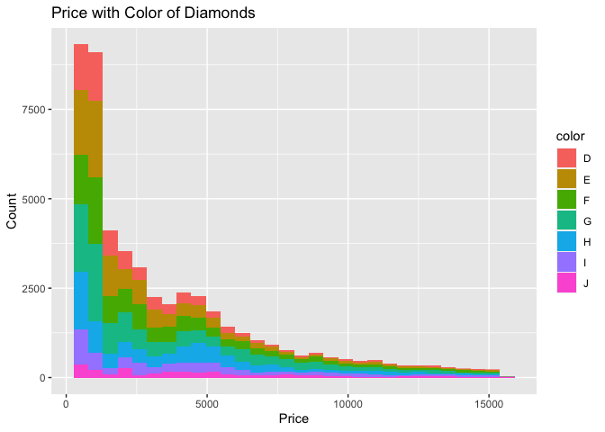

Diamond Data Analysis
================

-   [Libraries & Data](#libraries--data)
-   [Data Cleaning](#data-cleaning)
    -   [Count N/A Values](#count-na-values)
    -   [Remove Wrong Entries](#remove-wrong-entries)
    -   [Plotting Outliers](#plotting-outliers)
    -   [Removing Outliers](#removing-outliers)
-   [Exploratory Data Analysis](#exploratory-data-analysis)
    -   [Summary Stats](#summary-stats)
    -   [Price Plots](#price-plots)
    -   [VIF](#vif)
-   [Predict Price Using Regression](#predict-price-using-regression)
    -   [Spliting Data](#spliting-data)
    -   [Linear Regression Model](#linear-regression-model)
    -   [Ridge and Lasso Regression
        Models](#ridge-and-lasso-regression-models)
    -   [Predict](#predict)
    -   [Results](#results)

## Libraries & Data

``` r
library(tidyverse)
```

    ## ── Attaching packages ─────────────────────────────────────── tidyverse 1.3.2 ──
    ## ✔ ggplot2 3.3.6      ✔ purrr   0.3.5 
    ## ✔ tibble  3.1.8      ✔ dplyr   1.0.10
    ## ✔ tidyr   1.2.1      ✔ stringr 1.4.1 
    ## ✔ readr   2.1.3      ✔ forcats 0.5.2 
    ## ── Conflicts ────────────────────────────────────────── tidyverse_conflicts() ──
    ## ✖ dplyr::filter() masks stats::filter()
    ## ✖ dplyr::lag()    masks stats::lag()

``` r
library(dplyr)
library(car)
```

    ## Loading required package: carData
    ## 
    ## Attaching package: 'car'
    ## 
    ## The following object is masked from 'package:dplyr':
    ## 
    ##     recode
    ## 
    ## The following object is masked from 'package:purrr':
    ## 
    ##     some

``` r
library(cowplot)
library(ggcorrplot)
library(fastDummies)
library(glmnet)
```

    ## Loading required package: Matrix
    ## 
    ## Attaching package: 'Matrix'
    ## 
    ## The following objects are masked from 'package:tidyr':
    ## 
    ##     expand, pack, unpack
    ## 
    ## Loaded glmnet 4.1-4

``` r
library(Metrics)
set.seed(999)

df <- read.csv("diamond_data.csv")
```

## Data Cleaning

### Count N/A Values

``` r
colSums(is.na(df))
```

    ##   carat     cut   color clarity   depth   table   price       x       y       z 
    ##       0       0       0       0       0       0       0       0       0       0

### Remove Wrong Entries

``` r
df %>%
  summarise(x_zero = sum(x==0), y_zero = sum(y==0), z_zero = sum(z==0))
```

    ##   x_zero y_zero z_zero
    ## 1      8      7     20

``` r
df <- df %>% 
  subset(x != 0 & y != 0 & z != 0)
```

### Plotting Outliers

``` r
out_carat <- ggplot(data = df, aes(y = carat)) + 
  ggtitle("Outliers in Carat") + 
  geom_boxplot() + 
  theme_light()

out_depth <- ggplot(data = df, aes(y = depth)) + 
  ggtitle("Depth") + 
  geom_boxplot() + 
  theme_light()

out_table <- ggplot(data = df, aes(y = table)) + 
  ggtitle("Table") + 
  geom_boxplot() + 
  theme_light()

out_x <- ggplot(data = df, aes(y = x)) + 
  ggtitle("X") + 
  geom_boxplot() + 
  theme_light()

out_y <- ggplot(data = df, aes(y = y)) + 
  ggtitle("Y") + 
  geom_boxplot() + 
  theme_light()

out_z <- ggplot(data = df, aes(y = z)) + 
  ggtitle("Z") + 
  geom_boxplot() + 
  theme_light()

out_price <- ggplot(data = df, aes(y = price)) + 
  ggtitle("Price") + 
  geom_boxplot() + 
  theme_light()


plot_grid(out_carat, out_depth, out_table, out_x, out_y, out_z)
```

<!-- -->

### Removing Outliers

``` r
remove_outliers <- function(df, columns) {
  for (col in columns) {
    col_mean <- mean(df[[col]])
    col_sd <- sd(df[[col]])
    df <- df[!(df[[col]] > col_mean + 3*col_sd | df[[col]] < col_mean - 3*col_sd),]
  }
  return(df)
}

df_clean <- remove_outliers(df, c("carat", "depth", 'table','price','x','y',"z"))

out_carat <- ggplot(data = df_clean, aes(y = carat)) + 
  ggtitle("Outliers in Carat") + 
  geom_boxplot() + 
  theme_light()

out_depth <- ggplot(data = df_clean, aes(y = depth)) + 
  ggtitle("Depth") + 
  geom_boxplot() + 
  theme_light()

out_table <- ggplot(data = df_clean, aes(y = table)) + 
  ggtitle("Table") + 
  geom_boxplot() + 
  theme_light()

out_x <- ggplot(data = df_clean, aes(y = x)) + 
  ggtitle("X") + 
  geom_boxplot() + 
  theme_light()

out_y <- ggplot(data = df_clean, aes(y = y)) + 
  ggtitle("Y") + 
  geom_boxplot() + 
  theme_light()

out_z <- ggplot(data = df_clean, aes(y = z)) + 
  ggtitle("Z") + 
  geom_boxplot() + 
  theme_light()

out_price <- ggplot(data = df_clean, aes(y = price)) + 
  ggtitle("Price") + 
  geom_boxplot() + 
  theme_light()


plot_grid(out_carat, out_depth, out_table, out_x, out_y, out_z)
```

<!-- -->

## Exploratory Data Analysis

### Summary Stats

``` r
numerical_features <- select_if(df_clean, is.numeric)
categorical_features <- select_if(df_clean,is.character)

summary(numerical_features)
```

    ##      carat            depth           table           price      
    ##  Min.   :0.2000   Min.   :57.50   Min.   :51.00   Min.   :  326  
    ##  1st Qu.:0.3900   1st Qu.:61.10   1st Qu.:56.00   1st Qu.:  921  
    ##  Median :0.7000   Median :61.90   Median :57.00   Median : 2283  
    ##  Mean   :0.7553   Mean   :61.76   Mean   :57.34   Mean   : 3540  
    ##  3rd Qu.:1.0200   3rd Qu.:62.50   3rd Qu.:59.00   3rd Qu.: 5014  
    ##  Max.   :2.2100   Max.   :66.00   Max.   :63.50   Max.   :15450  
    ##        x               y               z        
    ##  Min.   :3.730   Min.   :3.680   Min.   :1.530  
    ##  1st Qu.:4.680   1st Qu.:4.700   1st Qu.:2.890  
    ##  Median :5.650   Median :5.650   Median :3.490  
    ##  Mean   :5.648   Mean   :5.651   Mean   :3.489  
    ##  3rd Qu.:6.480   3rd Qu.:6.480   3rd Qu.:4.010  
    ##  Max.   :8.600   Max.   :8.530   Max.   :5.300

``` r
summary(categorical_features)
```

    ##      cut               color             clarity         
    ##  Length:51179       Length:51179       Length:51179      
    ##  Class :character   Class :character   Class :character  
    ##  Mode  :character   Mode  :character   Mode  :character

``` r
# shows proportion for each feature but better as visual 
# sapply(categorical_features, function(x) prop.table(table(x)))  
```

### Price Plots

``` r
ggplot(data = df_clean, aes(x=price, fill=cut)) + 
  geom_histogram(bins = 30) +
  labs(y="Count", x="Price", title="Price with Cut of Diamonds") 
```

<!-- -->

``` r
ggplot(data = df_clean, aes(x=price, fill=color)) + 
  geom_histogram(bins = 30) +
  labs(y="Count", x="Price", title="Price with Color of Diamonds") 
```

<!-- -->

``` r
ggplot(data = df_clean, aes(x=price, fill=clarity)) + 
  geom_histogram(bins = 30) +
  labs(y="Count", x="Price", title="Price with Clarity of Diamonds") 
```

<!-- -->
### Correlation Plot

``` r
ggcorrplot(cor(numerical_features), lab = TRUE)
```

<!-- -->

### VIF

``` r
model_vif_all <- lm(data = df_clean, formula = price ~ carat + depth + table + x + y + z)

vif_values <- vif(model_vif_all)

barplot(vif_values, main = "VIF Values, All Numerical Features", horiz = TRUE, col = "steelblue"
        ,las=1, xlab = 'VIF', ylab = 'Feature')

abline(v = 5, lwd = 3, lty = 2)
```

<!-- -->

``` r
model_vif_remove <- lm(data = df_clean, formula = price ~ carat + depth + table)

vif_values_remove <- vif(model_vif_remove)

barplot(vif_values_remove, main = "VIF Values, Minus X Y Z", horiz = TRUE, col = "steelblue"
        ,las=1, xlim= c(0,3), xlab = 'VIF', ylab = 'Feature')
```

<!-- -->

## Predict Price Using Regression

### Spliting Data

``` r
sample <- sample(c(TRUE, FALSE), nrow(df_clean), replace=TRUE, prob=c(0.7,0.3))

# linear regression df 
train  <- df_clean[sample, ]
test   <- df_clean[!sample, ]

# ridge and lasso df 

train_rid_las <- dummy_columns(train, select_columns = c('cut', 'color','clarity')
                               , remove_selected_columns = TRUE)
xtrain_rid_las <- data.matrix(select(train_rid_las, -c('price', 'x', 'y', 'z')))
ytrain_rid_las <- data.matrix(select(train_rid_las, c('price')))

test_rid_las <- dummy_columns(test, select_columns = c('cut', 'color','clarity')
                              , remove_selected_columns = TRUE)
xtest_rid_las <- data.matrix(select(test_rid_las, -c('price', 'x', 'y', 'z')))
ytest_rid_las <- data.matrix(select(test_rid_las, c('price')))
```

### Linear Regression Model

``` r
# linear regression 
linear_model <- lm(data = train, formula = price ~ carat + as.factor(cut) + as.factor(color) + 
                  as.factor(clarity))

summary(linear_model)
```

    ## 
    ## Call:
    ## lm(formula = price ~ carat + as.factor(cut) + as.factor(color) + 
    ##     as.factor(clarity), data = train)
    ## 
    ## Residuals:
    ##     Min      1Q  Median      3Q     Max 
    ## -5724.5  -587.0  -163.4   400.9  7848.8 
    ## 
    ## Coefficients:
    ##                         Estimate Std. Error t value Pr(>|t|)    
    ## (Intercept)             -6210.07      60.87 -102.02   <2e-16 ***
    ## carat                    8435.88      13.56  622.27   <2e-16 ***
    ## as.factor(cut)Good        542.57      41.52   13.07   <2e-16 ***
    ## as.factor(cut)Ideal       820.46      38.79   21.15   <2e-16 ***
    ## as.factor(cut)Premium     697.64      39.01   17.88   <2e-16 ***
    ## as.factor(cut)Very Good   672.89      39.28   17.13   <2e-16 ***
    ## as.factor(color)E        -190.69      18.36  -10.39   <2e-16 ***
    ## as.factor(color)F        -279.17      18.56  -15.04   <2e-16 ***
    ## as.factor(color)G        -428.77      18.23  -23.52   <2e-16 ***
    ## as.factor(color)H        -871.35      19.42  -44.86   <2e-16 ***
    ## as.factor(color)I       -1305.05      21.97  -59.41   <2e-16 ***
    ## as.factor(color)J       -1999.99      27.16  -73.64   <2e-16 ***
    ## as.factor(clarity)IF     4429.04      55.76   79.44   <2e-16 ***
    ## as.factor(clarity)SI1    2821.35      48.93   57.66   <2e-16 ***
    ## as.factor(clarity)SI2    1935.92      49.23   39.33   <2e-16 ***
    ## as.factor(clarity)VS1    3684.24      49.79   74.00   <2e-16 ***
    ## as.factor(clarity)VS2    3411.95      49.13   69.44   <2e-16 ***
    ## as.factor(clarity)VVS1   4191.30      52.09   80.46   <2e-16 ***
    ## as.factor(clarity)VVS2   4137.85      50.90   81.29   <2e-16 ***
    ## ---
    ## Signif. codes:  0 '***' 0.001 '**' 0.01 '*' 0.05 '.' 0.1 ' ' 1
    ## 
    ## Residual standard error: 949.9 on 35829 degrees of freedom
    ## Multiple R-squared:  0.9201, Adjusted R-squared:   0.92 
    ## F-statistic: 2.291e+04 on 18 and 35829 DF,  p-value: < 2.2e-16

### Ridge and Lasso Regression Models

``` r
# basic ridge regression 
ridge_model <- glmnet(x = xtrain_rid_las, y = ytrain_rid_las, alpha = 0, standardize = TRUE)

# basic lasso regression 
lasso_model <- glmnet(x = xtrain_rid_las, y = ytrain_rid_las, alpha = 1, standardize = TRUE)


# use cv to find optimal lambda value
cv_model_ridge <- cv.glmnet(xtrain_rid_las, ytrain_rid_las, alpha = 0)
cv_model_lasso <- cv.glmnet(xtrain_rid_las, ytrain_rid_las, alpha = 1)

#find lambda value that minimizes MSE
best_ridge_lambda <- cv_model_ridge$lambda.min

best_lasso_lambda <- cv_model_lasso$lambda.min

# plot of MSE by lambda value
plot(cv_model_ridge) 
```

<!-- -->

``` r
plot(cv_model_lasso) 
```

<!-- -->

``` r
best_ridge_model <- glmnet(x = xtrain_rid_las, y = ytrain_rid_las, alpha = 0
                           , lambda = best_ridge_lambda)

best_lasso_model <- glmnet(x = xtrain_rid_las, y = ytrain_rid_las, alpha = 1
                           , lambda = best_lasso_lambda)
```

### Predict

``` r
y_pred_linear <- predict(linear_model, newdata = test[, colnames(test)[colnames(test) != 'price']])

y_pred_ridge <- predict(best_ridge_model, newx = xtest_rid_las)

y_pred_lasso <- predict(best_lasso_model, newx = xtest_rid_las)
```

### Results

``` r
RSQUARE = function(y_actual,y_predict){
  round(cor(y_actual,y_predict)^2,3)
}

metrics_lin <- c('Linear Regression',rmse(test$price,y_pred_linear), mae(test$price,y_pred_linear)
                  , RSQUARE(test$price,y_pred_linear))

metrics_rid <- c('Ridge Regression',rmse(ytest_rid_las,y_pred_ridge), mae(ytest_rid_las,y_pred_ridge)
                 , RSQUARE(ytest_rid_las,y_pred_ridge))

metrics_las <- c('Lasso Regression',rmse(ytest_rid_las,y_pred_lasso), mae(ytest_rid_las,y_pred_lasso)
                , RSQUARE(ytest_rid_las,y_pred_lasso))


model_metrics <- list(metrics_lin, metrics_rid, metrics_las)

metrics_df <- as.data.frame(do.call(rbind, model_metrics))
colnames(metrics_df) <- c('Model','RMSE','MSE','R^2')
metrics_df
```

    ##               Model             RMSE              MSE   R^2
    ## 1 Linear Regression 942.296773808064 673.352666321433 0.922
    ## 2  Ridge Regression 1018.30195818907 663.110006381553  0.92
    ## 3  Lasso Regression 942.004350981537 669.962058032012 0.922

``` r
plot(y_pred_linear, test$price,
     xlab = "Predicted Values"
     , ylab = "Acutal Values"
     , main = 'Linear Regression Predicted Vs. Actual')

abline(a = 0, b = 1, lwd=2,
       col = "green")
```

<!-- -->
